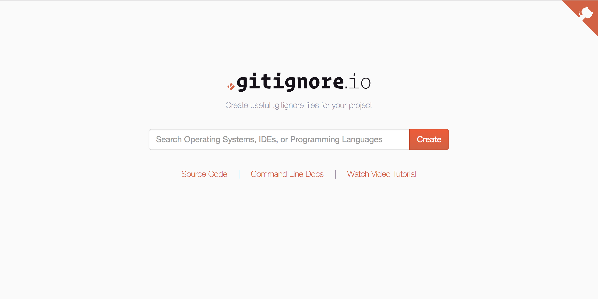

[Home](index.md) | [Manual Assessment Memo](manual_assessment_memo.md) | [Chatbot](chatbot.md) | [Procedure Video](procedure_video.md) | [Manual](manual.md) | [Reflective Blogs](reflective_blogs.md) | [Statement of AI](AIstatement.md) 

# Manual 

## GitHub Pages: A Beginner-Friendly Guide for Students and Hobby Coders 

### Table of Contents 

## Table of Contents

1. [Introduction to GitHub & GitHub Pages](#1-introduction-to-github--github-pages)  
2. [Why Use GitHub Pages?](#2-why-use-github-pages)  
3. [Getting Started with GitHub](#3-getting-started-with-github)  
4. [Creating Your First Repository](#4-creating-your-first-repository)  
5. [Understanding Branches & Commits](#5-understanding-branches--commits)  
6. [Forking Repositories and Why It Matters](#6-forking-repositories-and-why-it-matters)  
7. [Introduction to GitHub Pages Hosting](#7-introduction-to-github-pages-hosting)  
8. [Creating a GitHub Pages Site (Step-by-Step)](#8-creating-a-github-pages-site-step-by-step)  
9. [Using a Custom Domain with GitHub Pages](#9-using-a-custom-domain-with-github-pages)  
10. [Using Jekyll for Blog-Style Sites](#10-using-jekyll-for-blog-style-sites)  
11. [Theme Customization](#11-theme-customization)  
12. [Markdown Basics for GitHub Pages](#12-markdown-basics-for-github-pages)  
13. [Using HTML, CSS, and JavaScript with GitHub Pages](#13-using-html-css-and-javascript-with-github-pages)  
14. [Project Ideas to Host with GitHub Pages](#14-project-ideas-to-host-with-github-pages)  
15. [Common Errors and How to Fix Them](#15-common-errors-and-how-to-fix-them)  
16. [GitHub Desktop: An Easier Way to Manage Repos](#16-github-desktop-an-easier-way-to-manage-repos)  
17. [More GitHub Features to Explore](#17-more-github-features-to-explore)  
18. [Using GitHub Pages for Class Projects](#18-using-github-pages-for-class-projects)  
19. [Design Tips for GitHub Pages Sites](#19-design-tips-for-github-pages-sites)  
20. [Securing Your GitHub Pages Site](#20-securing-your-github-pages-site)  
21. [Collaborating with Others](#21-collaborating-with-others)  
22. [Maintaining Your Site Over Time](#22-maintaining-your-site-over-time)  
23. [Useful Resources & Communities](#23-useful-resources--communities)  
24. [Glossary](#24-glossary)  
25. [Final Tips & What’s Next](#25-final-tips--whats-next)  

### 1. Introduction to GitHub & GitHub Pages 

GitHub is a cloud-based platform where developers store code, collaborate on projects, and manage version control using Git. GitHub Pages is a free feature that allows you to publish static websites directly from your GitHub repository. 

### 2. Why Use GitHub Pages? 

    - Free Hosting: No cost for hosting simple HTML/CSS/JS websites 

    - Perfect for Portfolios: Show off projects, resumes, blogs 

    -  No Server Management: Everything is served as static content 

    - Version Control: Easily roll back to previous versions 
    
### 3. Getting Started with GitHub 

    1. Go to github.com 

    2. Create an account (free) 

    3. Set your username, email, and password 

    4. Verify your email and log in 

### 4. Creating Your First Repository 

    1. Click the + in the top-right and select New Repository 

    2. Name it (e.g., my-portfolio) 

    3. Add a description (optional) 

    4. Choose Public or Private 

    5. Check Initialize this repo with a README 

    6. Click Create Repository 

### 5. Understanding Branches & Commits 

    - Branch: A version of your project. The default is usually main. 

    - Commit: A snapshot of your code. Each time you make changes, write a message like "Added homepage layout" and commit them. 

    - Use Pull Requests to merge changes from one branch to another. 

### 6. Forking Repositories and Why It Matters 

    Forking is copying someone else's repository to your own account so you can experiment or improve it. 

    Why Fork?:

    - Try out code safely 

    - Make changes and suggest improvements with Pull Requests 
    
    - Build on open-source projects 

    How to Fork: 

    - Visit any public repository 

    - Click Fork in the top right 

    - It creates a copy in your GitHub account 

    - Work on your fork without affecting the original repo 

 ### 7. Introduction to GitHub Pages Hosting 

    GitHub Pages lets you publish a website directly from your repository using the files in your main or gh-pages branch. 

    You can host: 

    -  Project Pages (in a specific repo) 

    - User Pages (from a repo named username.github.io) 

### 8. Creating a GitHub Pages Site (Step-by-Step) 

    1. Create or open your repo 

    2. Add your HTML/CSS/JS files 

    3. Go to Settings > Pages 

    4. Under "Source," select main branch (or docs/ folder) 

    5. Click Save 

    6. Your site is now live at https://yourusername.github.io/repo-name/ 
    
### 9. Using a Custom Domain with GitHub Pages 

Want to use your own domain? 

    1. Buy a domain name from a registrar (e.g., Namecheap) 

    2. In your repo, go to Settings > Pages and enter your domain 

    3. Update your DNS settings: 

        -  Add a CNAME record pointing to yourusername.github.io 

    5. Confirm in GitHub that your domain is connected 

### 10. Using Jekyll for Blog-Style Sites 

Jekyll is a static site generator built into GitHub Pages. It turns Markdown files into blog posts. 

    - Use a theme with _config.yml 

    - Create blog posts in _posts/ with the format YYYY-MM-DD-title.md 

    - Add front matter like: 

        --- 
        title: "My First Blog" 
        date: 2025-04-08 
        --- 

### 11. Theme Customization 

Choose a theme via Settings > Pages > Theme Chooser. 

Or manually set it in _config.yml: 

theme: minima 

Customize colors, fonts, and layouts with custom CSS and HTML overrides. 

### 12. Markdown Basics for GitHub Pages 

Markdown is a lightweight markup language that allows you to format text easily. It’s often used in GitHub repositories, README files, and wikis. Markdown files have a .md extension and are a great way to document your projects, write blog posts, or create structured content for GitHub Pages. 

Here are some rules of thumb: 
    - # Heading 1 

    - ## Heading 2 

    - **bold**, *italic*, `code` 

    - Lists: -, *, 1. 

    - Links: [text](url) 

    - Images:  

### 13. Using HTML, CSS, and JavaScript with GitHub Pages 

You can create fully custom sites by uploading: 

   -  .html for structure 

   -  .css for styling 

   -  .js for interactivity 

Place your code in the root or docs/ folder depending on your Pages settings. 

While Markdown is great for simple formatting, HTML is the backbone of most web content. If you want more control over the structure and layout of your GitHub Pages site, you can incorporate HTML, CSS, and JavaScript. 

Using HTML in GitHub Pages: 

GitHub Pages allows you to use standard HTML to build your site. You can create .html files and place them in your repository. Here’s a simple example of an HTML page for your GitHub Pages site: 

### 14. Project Ideas to Host with GitHub Pages 

    - Online portfolio 

    - Blog or writing journal 

    - Resume or CV 

    - JavaScript games 

    - Documentation for a class or project 

### 15. Common Errors and How to Fix Them 

    - 404 Error: Check file paths or if Pages is enabled 

    - DNS Errors: Make sure your domain is correctly configured 

    - Nothing displays: Ensure there's an index.html file in your repo 

### 16. GitHub Desktop: An Easier Way to Manage Repos 
Don’t like the terminal? GitHub Desktop is a GUI for Git: 

    - Clone repos with one click 

    - Commit changes via buttons 

    - Visual diff viewer to track changes 
    
Great for beginners! 

### 17. More GitHub Features to Explore 

GitHub Actions 

Automate tasks directly from your GitHub repo, like deploying your site when you push changes. Example workflows: 

    - Automatically build and deploy a Jekyll site 

    - Lint and test code on push 

    - Schedule regular tasks 

Pull Requests 

Used to propose changes. When you fork a repo and want to contribute back: 

    - Push your changes to your fork 

    - Click New Pull Request on the original repo 

    - Maintainers can review and merge your changes 
Issues & Discussions 

Great for collaboration: 

    - Use Issues to track bugs, improvements, and tasks 

    - Use Discussions to chat with other contributors, ask questions, or gather feedback 

### GitHub Gists 

Host and share small code snippets easily. Gists can be public or private and support versioning just like regular repos. 

### Project Boards 

Kanban-style boards to track progress with To Do, In Progress, and Done columns. Use them for organizing multi-step projects or group work. 

### GitHub CLI (Command Line Interface) 

Advanced users can interact with GitHub using commands like: 

gh repo clone username/repo 

Useful for scripting and automation! 

### Contributions & Insights 

Each repo has a Contributors section and analytics on commits, code frequency, and traffic. These help you track project health. 

### Pages Analytics (via 3rd-party tools) 
GitHub Pages doesn’t have built-in analytics, but you can add: 

    - Google Analytics (via <script> tag in your HTML) 

    - Plausible or other privacy-friendly alternatives 

### Pinning Repositories 

You can pin your best or most active projects to your GitHub profile so visitors see them first. Go to your profile and click the "Customize your pins" button. 

### Profile README 

Add a personalized README to your GitHub profile to show off your skills, links, and current work. Create a repo named after your username to activate this feature. 
# Hi there 👋 I'm a student learning web development. Welcome to my GitHub! 

### 18. Using GitHub Pages for Class Projects

GitHub Pages can be a great way to present schoolwork like:

- Final projects

- Interactive data visualizations

- Course documentation

You can also collaborate with classmates on shared group projects through GitHub repositories.

### 19. Design Tips for GitHub Pages Sites

Keep your site clean and accessible:

- Use simple color schemes

- Add plenty of white space

- Use headings, bullets, and spacing to break up text

- Make sure links are clearly labeled

Try Google Fonts or CSS frameworks like Bootstrap to spice things up.

### 20. Securing Your GitHub Pages Site

Even though it's static, take care with what you publish:

- Don’t upload sensitive data (like API keys)

- Use .gitignore to skip unnecessary files

- Consider enabling HTTPS in Pages settings

  
### 21. Collaborating with Others

GitHub makes teamwork easier:

- Add collaborators in the repo’s settings

- Use issues to assign tasks and track bugs

- Create branches so you don’t overwrite each other’s work

### 22. Maintaining Your Site Over Time

Treat your site like a living document:

- Check and update content regularly

- Add new projects or updates to your bio

- Archive old pages or make a changelog

### 23. Useful Resources & Communities 

- [GitHub Docs](https://docs.github.com/)  
  The official GitHub documentation is your go-to guide for anything GitHub-related—from basics to advanced workflows.

- [Pages Help](https://docs.github.com/pages)  
  Specific documentation for GitHub Pages, including deployment steps, theme support, and domain settings.

- [Jekyll Docs](https://jekyllrb.com/docs/)  
  If you're using Jekyll to build a blog or themed site on GitHub Pages, this is where you'll find everything from templates to plugins.

- [Stack Overflow](https://stackoverflow.com/)  
  Ask questions, search for errors, and find solutions from the global developer community.

- [Dev.to](https://dev.to/)  
  A welcoming community for software developers with lots of tutorials and GitHub project showcases.

- [Reddit r/github](https://www.reddit.com/r/github/)  
  A subreddit for GitHub users to share updates, ask for help, or discover new projects.

- [GitHub Education](https://education.github.com/)

 
### 24. Glossary 

# Glossary

| **Term**              | **Definition**                                                                 |
|-----------------------|--------------------------------------------------------------------------------|
| **Repository (Repo)**  | A project folder hosted on GitHub.                                               |
| **Commit**             | A saved snapshot of your code changes.                                           |
| **Branch**             | A separate version of your codebase, allowing for independent work on features. |
| **Merge**              | Combining branches into one, typically after reviewing changes.                 |
| **Pull Request**       | A proposed change waiting for approval, usually after forking a repository.      |
| **Static Site**        | A website with fixed HTML, CSS, and JavaScript content, without a backend.      |
| **DNS**                | Domain Name System, used to link custom domains to servers.                     |
| **Fork**               | A personal copy of someone else's GitHub repository, allowing for experimentation or contributions. |
| **GitHub Actions**     | Automation tools for CI/CD on GitHub, enabling tasks like deployment and testing. |
| **Gist**               | A mini repository for sharing code snippets, either public or private.         |
| **GitHub Pages**       | A hosting feature for static websites, directly from repositories.              |
| **Profile README**     | A custom welcome message on your GitHub profile, activated by creating a repo named after your username. |
| **Project Board**      | A visual management tool that uses boards like **To Do**, **In Progress**, and **Done** to track tasks and progress. |
| **GitHub CLI**         | Command-line interface for managing GitHub repos directly from the terminal.    |
| **Insights**           | Analytics about contributions and activity within a repo, helping track project health. |

 

### 25. Final Tips & What’s Next 

    - Keep your profile updated 
    - Experiment with HTML and Markdown 
    - Explore Jekyll and custom domains 
    - Contribute to open-source projects
    - Build and showcase your digital portfolio 

Ai Statement:  ChatGPT GPT-4o was used to create this manual.
