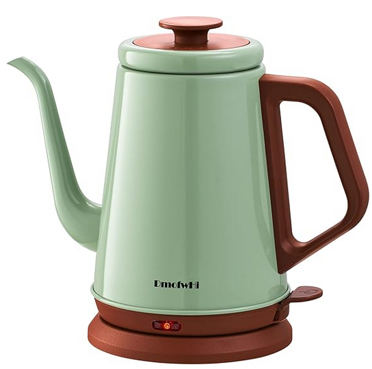
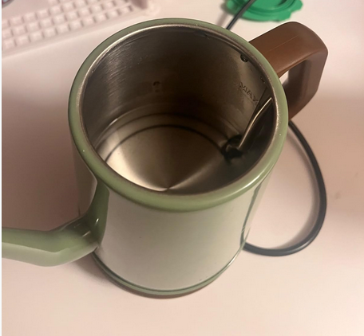

[Home](index.md) | [Manual Assessment Memo](manual_assessment_memo.md) | [Chatbot](chatbot.md) | [Procedure Video](procedure_video.md) | [Manual](manual.md) | [Reflective Blogs](reflective_blogs.md) | [Statement of AI](AIstatement.md) 

# Table of Contents 
1. [Wayback Analysis](#wayback-analysis)
2. [Quick Start Guide](#quick-start-guide)
3. [Reflective Blog 3](#reflective-blog-3)
4. [Reflective Blog 4](#reflective-blog-4)
   
# Wayback Analysis
For this assignment I chose to analyze the design of a amazon webpage from 2005. 

The first thing I noticed was how crowded with information and ads Amazon’s homepage was. While the basic structure was in place—a search bar at the top center, product recommendations, and categories—everything seemed to be competing for attention. TThe top of the page had a horizontal navigation bar with categories like "Books," "Electronics," and "Clothing," but it wasn’t as intuitive or easy to navigate as current designs. I had to read everything carefully and sift through tdifferent features to find what I was looking for. I think the utilitarian fonts added to this confusion. Nothing was bolded or highlighted to stand out more in the sea of information. Maybe with the exception of promotional ads (something amazon decided placementon but not design). Otherwise the site was lacking in graphics.

The promotional bannersfeatured under product reccomendations stuck out slightly more with their white-text-on-blue back design. It detailed options, including an advertisement for Amazon’s own credit card and other promotional banners. I beleive the overwhelmingly white background used for this site's design coupled with the use of light blue text links, washes out information and makes the site difficult to navigate. There's too much white space and the text doesn't stand out enough against it.

Today, Amazon uses a cleaner, more dynamic layout that focuses more on user intent and behavior rather than overwhelming them with too many options upfront.

---
# Quick Start Guide
For this assignment I chose to make a quick start guide for an electric kettle. As such this quick start guide will be targeted at consumers.

Step 1: Unbock and Inspect the Kettle.
Unbox the kettle. This kettle comes with a plug-in base, a kettle body, and a top. Take off the top and inspect the kettle for any damage or dirt. Wipe it down with a damp rag to be safe.

Step 2: Find a place for your kettle and plug-in the base. 
Decide where you desire to place your kettle. Maybe you want to keep it on the kitchen counter or a table in the office breakroom. It should be a place close to an electrical outlet. Now plug in the base.

Step 3: Fill Kettle with water and heat.
Take the kettle body, remove the top, and fill with water. Place the lid back on. Now place the full kettle onto the plued-in base. Push down the button by the base of the kettle handle to start the kettle.

Step 4: Make tea or coffee.
Now that your water boiled, use it for tea or coffee in the mug of your choice!

Step 5: Maintnaince aka Descaling the Kettle.
Limescale can build up in kettles and coffe makers due to hard water. Once a month, one should fill their kettle with an inch of white vinegar ntill evaporation to break down this limescale. After this rinse out with water and use as usual.

## Assignment Rationale 
This assignment will let you experiment with a generative AI tool of your choice, and you will strengthen your critical thinking skills as you evaluate its strengths and weaknesses.

## Where to Start
Think of a product that you already know how to use. It can be a bluetooth headset, an app, a video game, a sewing machine, or anything that requires a little bit of setup to use.

## Assignment Steps
This assignment is a little more structured than others in our course, so please follow these steps:
1. Open Copilot or any other text-based generative AI tool you prefer (don't pay for it unless you happen to already have a subscription)
2. Write a prompt that asks it to generate a quick-start guide for your product of choice. (copy and paste this somewhere - it is part of what you need to turn in)
3. Evaluate the output. Try to follow the steps yourself, or at least imagine following them.
4. Prompt it again (and again) if needed (again saving your prompts somewhere).
5. Reflect on the process and write a short (200 words) reflection on the tool's strengths, weaknesses, and anything that you learned (or anything that surprised you).

## What is Due
On your portfolio, post the following:
-The name of the tool (with the link if you have it)
-Your prompts
-The best output 
-Your reflection 
---
# Reflective Blog 3
Prompt A: Reflect on your assigned reading this week in a detailed manner that demonstrates you read and understood the assigned reading. What can you 'take away' from this reading? What insightful concepts did you read about that can inform your own technical communication activities? 

Reflection: For this reflection, I chose to focus on the assigned reading "Eight Principles of Information Architecture" by Dan Brown, because I think it provides useful guidelines for individuals getting started in web design. The reading outlines eight principles that help shape intuitive, accessible, and scalable websites. These principles are applicable not only to web design but also to broader areas of technical communication. As a student juggling multiple web design projects this semester, I found these guidlines incredibly useful and aplicable to my other classes.

One key takeaway is the Principle of Objects, which encourages designers to view content as living entities with unique characteristics and relationships. This concept reminded me that content isn't just isolated text or images but rather information that a userbase has to actively interact with.

Another insightful principle is the Principle of Choices, which highlights the importance of offering users clear and limited options. Too many choices can overwhelm users, making navigation frustrating. I realized that when I communicate technical information, simplifying choices and focusing on clarity can improve the user's understanding and experience.

The Principle of Disclosure stood out as particularly relevant to technical communication. It suggests revealing just enough information to help users decide whether to dig deeper. This principle parallels the practice of layering technical content so readers can grasp the essentials without feeling overloaded.

The Principle of Exemplars is another useful concept, as it advocates for using examples to clarify abstract categories. I've noticed that when technical documentation includes relatable examples, it becomes much easier to comprehend.

The Principle of Front Doors reminds designers that users can enter a website from any page. This principle resonated with me because it underscores the need for consistent navigation and context across all pages. Similarly, in technical communication, each section of a document should provide enough context for readers who might jump directly to that section.

The Principle of Multiple Classification suggests offering various ways to access information, recognizing that different users have different mental models. This principle is especially important in technical documentation where diverse audiences may seek information in different ways.

The Principle of Focused Navigation advocates for organizing navigation logically without mixing categories. Clear navigation parallels clear document structure, which helps users find information more efficiently.

Finally, the Principle of Growth encourages designers to build flexible structures that can accommodate future content. This principle reminded me to consider long-term scalability when organizing technical content.

Overall, Brown's principles offer practical guidance for designing user-friendly websites and technical documents alike. I found the reading insightful and applicable to my own technical communication activities, particularly in terms of structuring content thoughtfully, simplifying information for clarity, and anticipating future needs.

# Reflective Blog 4
Prompt C: Ask a generative AI tool (maybe one in Boodlebox or Copilot) to generate something you might have to write in your future career. Assess the result, and then revise your prompt or "stack" an additional prompt onto it (e.g., "remove the passive voice and add headings"). Congratulations, you're a prompt engineer now. Add this skill to your resume. On your website, post: 1) your original and revised prompts 2) your assessment of what it generated 3) (optional) what it generated.

Reflection: For this reflection I entered the prompt: "Generate a detailed project proposal for a front-end developer working on a web application redesign for a comapny called LuLuDesign". Below is my first result. 

#### Prompt Result 1
**Project Proposal: Web Application Redesign**

Prepared by: Amber Morgan Role: Front-End Developer Date: 2/20/25 Project Title: Web Application Redesign for LuLuDesign 

#### 1. Project Overview

LuLuDesign plans to redesign its web application’s front-end to enhance user experience, improve accessibility, and modernize the interface using the latest front-end technologies. The team prioritizes responsiveness, performance optimization, and adherence to UI/UX best practices.

#### 2. Objectives

- Improve the visual appeal and usability of the web application.

- Enhance responsiveness to ensure compatibility with various screen sizes and devices.

- Optimize performance to reduce load times and improve interactivity.

- Ensure accessibility compliance with WCAG 2.1 standards.

- Implement modern front-end technologies for a scalable and maintainable codebase.

#### 3. Scope of Work

   ###### 3.1 Design Phase
   
   - Conduct user research and analyze feedback from current users.
   
   - Create wireframes and prototypes using Figma or Adobe XD.
   
   - Develop a design system for consistent UI elements.

   ###### 3.2 Development Phase

   - Convert approved UI designs into functional web pages.
   
   - Implement responsive design using CSS Grid, Flexbox, and media queries.
   
   - Utilize modern JavaScript frameworks (React.js, Vue.js, or Angular) for improved performance.
   
   - Optimize images, fonts, and scripts for faster loading times.
   
   - Ensure cross-browser compatibility and mobile responsiveness.

   ###### 3.3 Testing & Quality Assurance

   - Perform unit and integration testing for front-end components.
   
   - Conduct user testing to gather feedback on usability.
   
   - Fix bugs and optimize performance before deployment.

   ###### 3.4 Deployment & Maintenance

   - Deploy the redesigned application on a staging server for final review.
   
   - Migrate the new front-end to the production environment.
   
   - Provide documentation and train the internal team.
   
   - Offer ongoing support and updates as needed.

#### 4. Project Timeline
**Phase**----------**Task**------------------------------**Duration** 
Design---------Wireframing & Prototyping-----2 Weeks 
Development--Front-End Implementation------6 Weeks 
Testing---------QA & Bug Fixes-------------------2 Weeks 
Deployment---Launch & Maintenance----------1 Weeks 

Total Estimated Time: 11 Weeks
#### 5. Technology Stack

- HTML5, CSS3, JavaScript (ES6+)

- React.js/Vue.js/Angular (based on project requirements)

- Tailwind CSS / Bootstrap for styling

- Axios/Fetch API for data handling

- Webpack/Vite for bundling and optimization

- Jest/Cypress for testing

#### 6. Deliverables

- High-fidelity wireframes and design mockups.

- Fully responsive and optimized front-end codebase.

- Testing reports and bug fixes before launch.

- Documentation and maintenance plan.

#### 7. Budget Estimate

**Item**-----------------------------**Estimated Cost** 
UI/UX Design-------------------5k 
Front-End Development-------15k 
Testing & QA-------------------3k 
Deployment & Maintenance---2k 
**Total Estimated Budget**-------**25k** 

#### 8. Risks & Mitigation Strategies

**Risk**-----------------**Mitigation Strategy** 

Scope Creep--------------Define clear project requirements and use agile methodologies for flexibility. 

Performance Issues------Optimize assets and use efficient coding practices. 

Browser Compatibility---Test on multiple browsers and devices. 

Delays in Development---Set clear milestones and conduct regular progress reviews. 

#### 9. Conclusion
This project delivers a modernized, user-friendly, and high-performance web application that aligns with current industry standards. By implementing best practices in UI/UX design and front-end development, the team ensures an engaging and accessible experience for all users. The team will complete the project within the proposed timeline and budget, ensuring long-term value for LuLuDesign.

**Prepared by:** Amber Morgan 
Front-End Developer

#### Prompt Result 2:  
After this prompt result I decided to stack onto the prompt for edits: "Remove any tables and shorten this project purposal".The follwong is result 2. 

**Project Proposal: Web Application Redesign**Project Proposal: Web Application Redesign

Project Overview: The goal of this project is to redesign the front-end of an existing web application to enhance user experience (UX), improve functionality, and modernize the visual design. The redesign will focus on making the interface more intuitive, responsive, and accessible while ensuring seamless integration with the back-end services.

Project Objectives:

    Improve user interface (UI) and user experience (UX) design to create a more intuitive, engaging, and accessible platform.
    Optimize the web application for mobile and tablet devices, ensuring full responsiveness across all screen sizes.
    Implement modern front-end technologies (such as HTML5, CSS3, JavaScript, and relevant front-end frameworks like React or Angular) to improve performance and maintainability.
    Refactor the existing codebase for better readability and scalability.
    Ensure cross-browser compatibility and improve application performance by optimizing load times.

Scope of Work: The project will consist of the following key tasks:

    UI/UX Design: Work closely with the design team to refine the visual aspects of the application, including layout, typography, color schemes, and interactive elements. Conduct user testing to ensure that the design meets user needs.
    Front-End Development: Develop the front-end using modern technologies like HTML5, CSS3, JavaScript, and the chosen front-end framework (e.g., React or Angular). Focus on creating reusable components, ensuring modularity, and implementing smooth animations and transitions.
    Mobile Optimization: Use responsive design techniques to ensure the application functions smoothly on all device types, including smartphones and tablets.
    Integration with Back-End Services: Collaborate with back-end developers to ensure seamless integration with existing APIs and services, ensuring that data is displayed correctly and efficiently.
    Performance Optimization: Minimize file sizes, leverage lazy loading, and optimize the code to improve load times and overall performance.
    Cross-Browser Testing: Test the redesigned application across all major browsers (Chrome, Firefox, Safari, Edge) to ensure consistent behavior and appearance.
    Accessibility: Ensure the redesigned application adheres to accessibility standards (WCAG 2.1) to provide an inclusive experience for users with disabilities.

Project Timeline: The project will span approximately 12 weeks, broken down into the following phases:

    Phase 1: Discovery & Planning (Week 1-2)
        Define project requirements and gather feedback from stakeholders.
        Conduct research on current design trends and user preferences.
        Establish project milestones and deadlines.

    Phase 2: UI/UX Design (Week 3-4)
        Create wireframes, mockups, and prototypes for the redesigned application.
        Iterate the design based on feedback from stakeholders and user testing.
        Finalize design specifications for the front-end development phase.

    Phase 3: Front-End Development (Week 5-8)
        Start coding the front-end based on the approved designs.
        Build reusable components and implement interactivity using JavaScript and the selected front-end framework.
        Conduct unit tests and initial QA checks to ensure the functionality works as expected.

    Phase 4: Mobile Optimization & Testing (Week 9-10)
        Optimize the application for mobile responsiveness.
        Conduct cross-device testing and address any layout or performance issues.
        Perform accessibility testing to ensure compliance with WCAG standards.

    Phase 5: Integration & Final Testing (Week 11)
        Integrate the front-end with the back-end APIs and services.
        Conduct final testing, including cross-browser testing, load testing, and performance optimization.
        Address any remaining bugs or issues identified during the testing phase.

    Phase 6: Deployment & Review (Week 12)
        Deploy the redesigned application to the production environment.
        Monitor post-launch performance and gather user feedback for any further improvements.
        Provide documentation for future maintenance and updates.

Resources Required:

    Front-end Developer (Lead)
    UI/UX Designer
    Back-end Developer (for API integrations)
    QA Tester
    Project Manager

Technologies:

    HTML5, CSS3, JavaScript
    Front-end Framework (React.js, Angular, or Vue.js)
    CSS Preprocessing (Sass, LESS)
    Version Control (Git, GitHub)
    Testing Tools (Jest, Cypress)
    Design Tools (Figma, Adobe XD)

Budget Estimate: The estimated budget for the project is $30,000, which will cover the following:

    Developer salaries
    Design and prototyping tools
    Testing tools and licenses
    Miscellaneous expenses (hosting, third-party services)

Success Criteria:

    Improved user engagement and satisfaction, measured through analytics and user feedback.
    Enhanced application performance, including faster load times and smooth interaction.
    Compliance with accessibility guidelines, ensuring the application is accessible to a wider audience.
    On-time delivery of the redesigned web application within the allocated budget.

Conclusion: This web application redesign will significantly improve both the usability and functionality of the application, offering an enhanced experience for end-users. By adopting modern technologies and following a user-centered design approach, the project aims to meet both business goals and user needs.

This proposal outlines the objectives, scope, timeline, and resources needed to successfully complete the front-end redesign of the web application.
You said:
Project Proposal: Web Application Redesign

Prepared by: Amber Morgan
Role: Front-End Developer
Date: 2/20/25
Project Title: Web Application Redesign for LuLuDesign
1. Project Overview

LuLuDesign plans to redesign its web application’s front-end to enhance user experience, improve accessibility, and modernize the interface using the latest front-end technologies. The team prioritizes responsiveness, performance optimization, and adherence to UI/UX best practices.
2. Objectives

    Improve the visual appeal and usability of the web application.

    Enhance responsiveness to ensure compatibility with various screen sizes and devices.

    Optimize performance to reduce load times and improve interactivity.

    Ensure accessibility compliance with WCAG 2.1 standards.

    Implement modern front-end technologies for a scalable and maintainable codebase.

3. Scope of Work

###### 3.1 Design Phase

    Conduct user research and analyze feedback from current users.

    Create wireframes and prototypes using Figma or Adobe XD.

    Develop a design system for consistent UI elements.

###### 3.2 Development Phase

    Convert approved UI designs into functional web pages.

    Implement responsive design using CSS Grid, Flexbox, and media queries.

    Utilize modern JavaScript frameworks (React.js, Vue.js, or Angular) for improved performance.

    Optimize images, fonts, and scripts for faster loading times.

    Ensure cross-browser compatibility and mobile responsiveness.

###### 3.3 Testing & Quality Assurance

    Perform unit and integration testing for front-end components.

    Conduct user testing to gather feedback on usability.

    Fix bugs and optimize performance before deployment.

###### 3.4 Deployment & Maintenance

    Deploy the redesigned application on a staging server for final review.

    Migrate the new front-end to the production environment.

    Provide documentation and train the internal team.

    Offer ongoing support and updates as needed.

4. Project Timeline

Phase———-Task——————————Duration
Design———Wireframing & Prototyping—–2 Weeks
Development–Front-End Implementation——6 Weeks
Testing———QA & Bug Fixes——————-2 Weeks
Deployment—Launch & Maintenance———-1 Weeks

Total Estimated Time: 11 Weeks
5. Technology Stack

    HTML5, CSS3, JavaScript (ES6+)

    React.js/Vue.js/Angular (based on project requirements)

    Tailwind CSS / Bootstrap for styling

    Axios/Fetch API for data handling

    Webpack/Vite for bundling and optimization

    Jest/Cypress for testing

6. Deliverables

    High-fidelity wireframes and design mockups.

    Fully responsive and optimized front-end codebase.

    Testing reports and bug fixes before launch.

    Documentation and maintenance plan.

7. Budget Estimate

Item—————————–Estimated Cost
UI/UX Design——————-5k
Front-End Development——-15k
Testing & QA——————-3k
Deployment & Maintenance—2k
Total Estimated Budget——-25k
8. Risks & Mitigation Strategies

Risk Mitigation Strategy

Scope Creep Define clear project requirements and use agile methodologies for flexibility.

Performance Issues Optimize assets and use efficient coding practices.

Browser Compatibility Test on multiple browsers and devices.

Delays in Development Set clear milestones and conduct regular progress reviews.
9. Conclusion

This project delivers a modernized, user-friendly, and high-performance web application that aligns with current industry standards. By implementing best practices in UI/UX design and front-end development, the team ensures an engaging and accessible experience for all users. The team will complete the project within the proposed timeline and budget, ensuring long-term value for LuLuDesign.

Prepared by:
Amber Morgan
Front-End Developer
ChatGPT said:

Your project proposal is clear, well-organized, and comprehensive. It effectively outlines the key aspects of the web application redesign, from the initial design phase to deployment and maintenance. Here are a few suggestions to enhance it:

    Incorporate Clear Project Milestones: It might be helpful to add specific milestones for key achievements within the phases, such as completion of design reviews or the final user acceptance testing. This would help keep the project on track and make progress measurable.

    Add Stakeholder Engagement: It would be beneficial to outline how stakeholders will be engaged throughout the process (e.g., during design reviews, user testing, etc.). Regular feedback loops can improve the final product and ensure the team stays aligned with the project's goals.

    Refine the Budget Section: It could be useful to provide further breakdowns of how the budget is allocated (e.g., tools, licenses, personnel costs). This gives more transparency into where the funds are directed.

    Emphasize Communication: Highlight how the team will communicate, whether it’s through regular meetings, project management tools (e.g., Jira, Trello), or email updates. This can ensure smooth coordination throughout the project.

Here’s a brief enhanced version of your proposal, based on these suggestions:

Project Proposal: Web Application Redesign for LuLuDesign

Prepared by: Amber Morgan
Role: Front-End Developer
Date: 2/20/25
Project Title: Web Application Redesign for LuLuDesign
1. Project Overview

LuLuDesign plans to redesign its web application’s front-end to enhance user experience, improve accessibility, and modernize the interface using the latest front-end technologies. The redesign prioritizes responsiveness, performance optimization, and adherence to UI/UX best practices.
2. Objectives

    Improve the visual appeal and usability of the web application.
    Enhance responsiveness to ensure compatibility with various screen sizes and devices.
    Optimize performance to reduce load times and improve interactivity.
    Ensure accessibility compliance with WCAG 2.1 standards.
    Implement modern front-end technologies for a scalable and maintainable codebase.

3. Scope of Work

3.1 Design Phase:

    Conduct user research and analyze feedback from current users.
    Create wireframes and prototypes using Figma or Adobe XD.
    Develop a design system for consistent UI elements.

3.2 Development Phase:

    Convert approved UI designs into functional web pages.
    Implement responsive design using CSS Grid, Flexbox, and media queries.
    Utilize modern JavaScript frameworks (React.js, Vue.js, or Angular).
    Optimize images, fonts, and scripts for faster loading times.
    Ensure cross-browser compatibility and mobile responsiveness.

3.3 Testing & Quality Assurance:

    Perform unit and integration testing for front-end components.
    Conduct user testing to gather feedback on usability.
    Fix bugs and optimize performance before deployment.

3.4 Deployment & Maintenance:

    Deploy the redesigned application on a staging server for final review.
    Migrate the new front-end to the production environment.
    Provide documentation and train the internal team.
    Offer ongoing support and updates as needed.

4. Project Timeline
Phase	Task	Duration
Design	Wireframing & Prototyping	2 Weeks
Development	Front-End Implementation	6 Weeks
Testing	QA & Bug Fixes	2 Weeks
Deployment	Launch & Maintenance	1 Week

Total Estimated Time: 11 Weeks
5. Technology Stack

    HTML5, CSS3, JavaScript (ES6+)
    React.js/Vue.js/Angular (based on project requirements)
    Tailwind CSS / Bootstrap for styling
    Axios/Fetch API for data handling
    Webpack/Vite for bundling and optimization
    Jest/Cypress for testing

6. Deliverables

    High-fidelity wireframes and design mockups.
    Fully responsive and optimized front-end codebase.
    Testing reports and bug fixes before launch.
    Documentation and maintenance plan.

7. Budget Estimate
Item	Estimated Cost
UI/UX Design	$5,000
Front-End Development	$15,000
Testing & QA	$3,000
Deployment & Maintenance	$2,000
Total Estimated Budget	$25,000
8. Risks & Mitigation Strategies
Risk	Mitigation Strategy
Scope Creep	Define clear project requirements and use agile methodologies for flexibility.
Performance Issues	Optimize assets and use efficient coding practices.
Browser Compatibility	Test on multiple browsers and devices.
Delays in Development	Set clear milestones and conduct regular progress reviews.
9. Conclusion

This project will deliver a modernized, user-friendly, and high-performance web application that aligns with current industry standards. The team will complete the project within the proposed timeline and budget, ensuring long-term value for LuLuDesign.

Prepared by:
Amber Morgan
Front-End Developer

This revised version emphasizes communication, transparency in the budget, and introduces measurable milestones to ensure progress tracking.
You said:
Remove any tables and shorten this project purposal
ChatGPT said:

Here’s a more concise version of your project proposal without tables:

**Project Proposal: Web Application Redesign for LuLuDesign** 

Prepared by: Amber Morgan 
Role: Front-End Developer 
Date: 2/20/25 
Project Title: Web Application Redesign for LuLuDesign 

**1. Project Overview**

LuLuDesign aims to redesign its web application’s front-end to enhance user experience, improve accessibility, and modernize the interface using the latest technologies. The focus will be on creating a responsive, high-performance, and visually appealing web application that adheres to UI/UX best practices.

**2. Objectives**

   - Improve the visual appeal and usability.
   - Ensure compatibility across devices with a responsive design.
   - Optimize performance to reduce load times and improve interactivity.
   - Comply with WCAG 2.1 accessibility standards.
   - Implement scalable and maintainable front-end technologies.

**3. Scope of Work**

    Design Phase: Conduct user research, create wireframes, and develop a consistent design system. 
    Development Phase: Convert designs to functional web pages, implement responsive design, and use modern frameworks (React.js/Vue.js/Angular) for performance. 
    Testing & QA: Perform unit and integration testing, conduct user testing, and fix bugs. 
    Deployment & Maintenance: Deploy the application to a staging server, migrate to production, provide documentation, and offer ongoing support. 

**4. Timeline**

The project is estimated to take 11 weeks: 

    Design: 2 weeks 
    Development: 6 weeks 
    Testing: 2 weeks 
    Deployment: 1 week 

**5. Technology Stack**

   - HTML5, CSS3, JavaScript (ES6+)
   - React.js/Vue.js/Angular
   - Tailwind CSS/Bootstrap for styling
   - Axios/Fetch API for data handling
   - Jest/Cypress for testing

**6. Budget Estimate**
The total estimated budget is $25,000, covering UI/UX design, front-end development, testing, and deployment.

**7. Risks & Mitigation Strategies**

    - Scope Creep: Define clear requirements and use agile methodologies.
    - Performance Issues: Optimize assets and coding practices.
    - Browser Compatibility: Test across multiple browsers and devices.
   -  Delays: Set milestones and track progress regularly.

**8. Conclusion**

This redesign will deliver a modern, user-friendly, and high-performance web application that meets industry standards and enhances the user experience. The project will be completed within the proposed timeline and budget, ensuring long-term value for LuLuDesign.

**Prepared by:** 
Amber Morgan 
Front-End Developer

This version provides a more streamlined overview while maintaining key details about the project’s goals, scope, timeline, and budget.

# Reflective Blog 5
TBD

# Reflective Blog 6
TBD

# Reflective Blog 7
TBD

# Reflective Blog 8 (Optional - Make-up)
TBD
